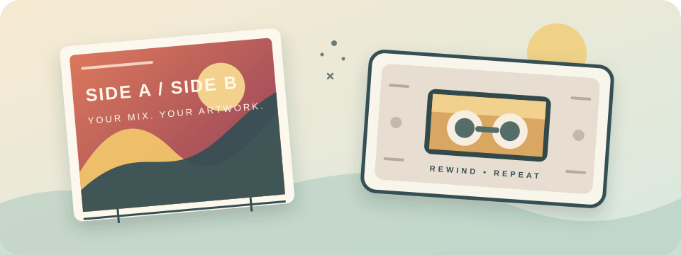

# Cassette J-Card Studio

### A free online studio for cassette J-cards, tape labels, and mixtape artwork.

Design it in your browser. Arrange it on the page. Print it at home.

Visit here : https://nhaloorsooraj.github.io/Cassette_J_Card_Studio/

 

 

**Make a cassette cover worth rewinding for.**

***

A **J-card maker**, **cassette J-card template**, **cassette cover designer**, or **cassette label maker**
Create custom artwork for mixtapes, demos, independent releases, and personal collections—right in your browser.

## Make it yours

| 🎨 Design                                                                                                                               | 🧩 Arrange                                                                                                                                      | 🖨️ Print                                                                                                             |
| :-------------------------------------------------------------------------------------------------------------------------------------- | :---------------------------------------------------------------------------------------------------------------------------------------------- | :-------------------------------------------------------------------------------------------------------------------- |
| Customize the J-card front and back, plus both cassette labels. Add artwork, text, tracklists, barcodes, logos, and production details. | Add colored shapes, crop and position images, reorder layers, adjust label bevels, and use canvas zoom, dark mode, grids, and alignment guides. | Preview the folded J-card and both labels on A4. Move items manually or auto-pack them, then export a multi-page PDF. |

### Made for the little details

* **Get a feel for the final piece:** inspect your design in an interactive 3D cassette and case preview.
* **Keep your layout in control:** drag artwork layers forward or backward, and use alignment guides as you position them.
* **Tune your labels:** set bevel size and choose top and/or bottom corners.
* **Start quickly:** use the built-in interactive tutorial, then keep creating at your own pace.
* **Save and open project files:** save a self-contained `.jcard` file with your design and original images. Repeated images are stored once as binary assets, without reducing image quality. **Save project** updates the chosen file during the current session; **Save as…** chooses another location. **Open project** restores `.jcard` files or older JSON snapshots. Browsers without direct file access download the file instead, using their download-location settings. Browser saves from earlier versions remain readable and migrate to IndexedDB.

## Start designing

If you are visiting the live GitHub Pages site, the editor is ready to use—no sign-up, installation, or paid subscription.

To run it locally:

1. Download or clone this repository.
2. Open `index.html` in a current desktop browser.
3. For the most reliable behavior, serve the project folder with a local static web server.

The app is a static site; it has no build step or application backend.

## From blank tape to print

1. Enter an album and artist name, then edit the Side A and Side B tracklists.
2. Add text, artwork, shapes, logos, or production details. Drag items on the canvas to position them.
3. Select **Save project** and choose a file name and folder. Use **Open project** to return to it later, or **Save as…** for a separate copy. **Share project** still creates a JSON snapshot.
4. Select **Export** to open the print preview.
5. Turn on **Manual placement** to move the J-card and labels, or choose **Auto-pack page** to restore the suggested layout.
6. Select **Save to PDF** in the preview.

## Print it right

The PDF uses **A4 landscape** pages. Page 1 places the folded J-card and both cassette labels together; additional pages show front and back reference artwork.

For accurate sizing, choose **100% / Actual size** in your print dialog and turn off “Fit to page.” Printer margins vary, so make a test print before printing multiple copies. Check the preview for overlaps and page placement before exporting.

## Disclaimer

This project is provided **“AS IS” and “AS AVAILABLE,” without warranties of any kind**, express or implied, including, without limitation, warranties of merchantability, fitness for a particular purpose, accuracy, reliability, or non-infringement.

To the maximum extent permitted by applicable law, the authors and contributors shall not be liable for any direct, indirect, incidental, special, consequential, exemplary, or other damages, losses, claims, or liabilities arising from or related to the use, misuse, inability to use, or reliance upon this project or any information, software, data, documentation, or other materials provided through it.

Users are solely responsible for evaluating the suitability, safety, legality, and consequences of using this project.

This disclaimer does not exclude or limit liability where such exclusion or limitation is prohibited by applicable law.

Users are responsible for ensuring that any images, artwork, logos, trademarks, text, fonts, or other content they import into or use with this project are owned by them or used with appropriate authorization. The authors and contributors do not assume responsibility for user-provided content or for any infringement or other legal consequences resulting from its use.

### Project file format

`.jcard` version 1 contains the ASCII signature `JCARD001`, a 4-byte little-endian manifest length, a UTF-8 JSON manifest, and the original binary image assets in manifest order. The manifest contains `version`, project `json`, and an `assets` list of `prefix` and byte `size`. Image references use `{ "__jcardImage": index }`; duplicate images share the same index. Uploaded artwork, custom logos, and images used in layers travel with the project. Opening validates the container before replacing the active design.

Direct file pickers require a supporting browser and a secure context (HTTPS or localhost). Otherwise Save downloads a `.jcard` file and Open uses a normal file upload picker. File handles are kept only for the current session; use Open after reloading to resume editing an existing file.

### Browser checks

Run `python tests/run-project-check.py --browser /path/to/chromium` (or an Edge executable). The checks use a temporary browser profile and cover large project saves, migration, failed-save recovery, file round trips, opening invalid files, file-picker/download flows, and flip-button layout. Native picker interactions are simulated.
